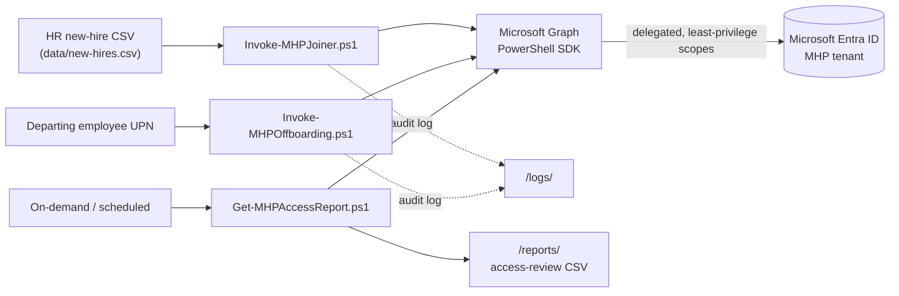
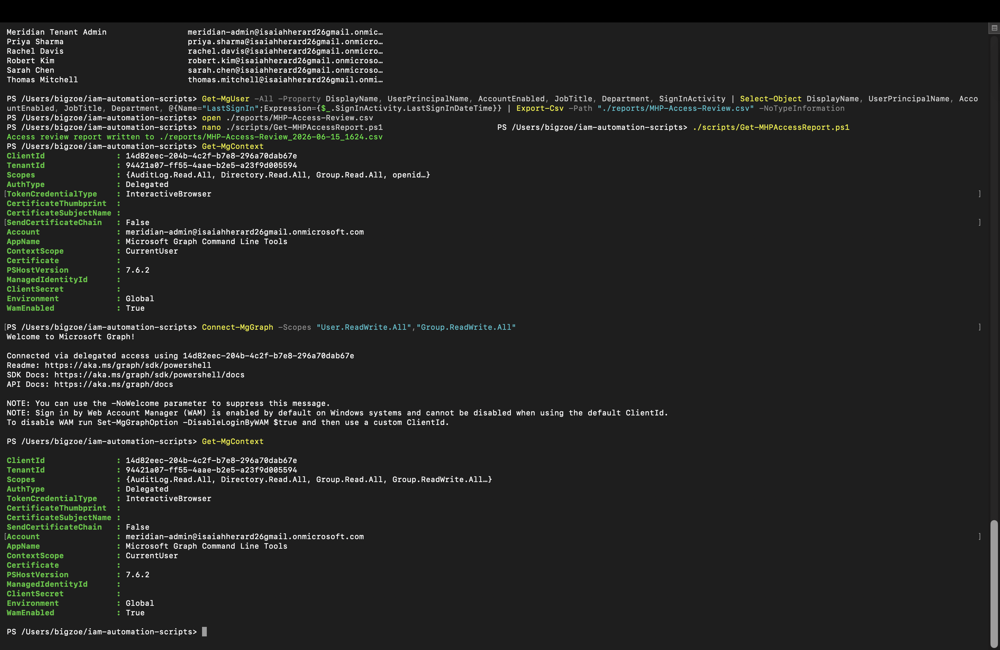
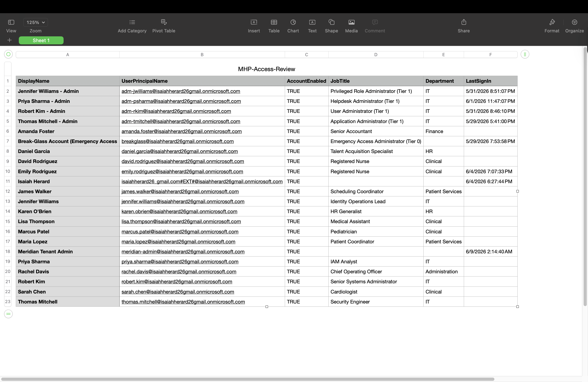
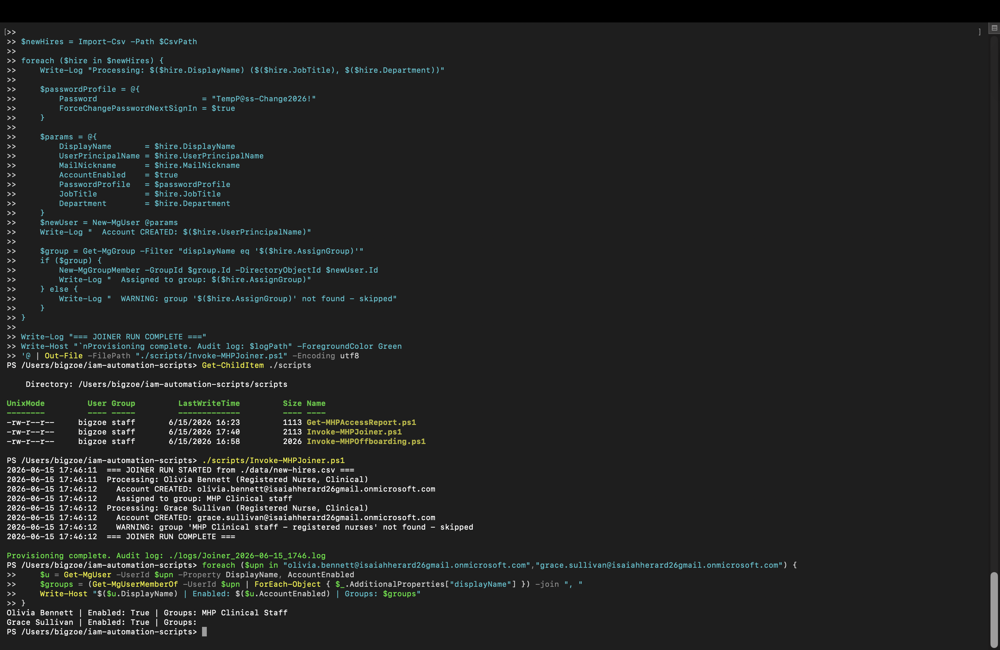
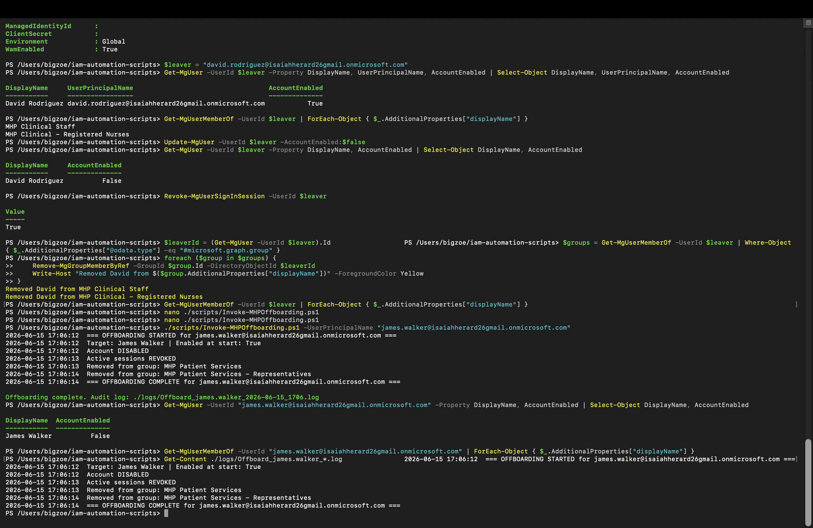
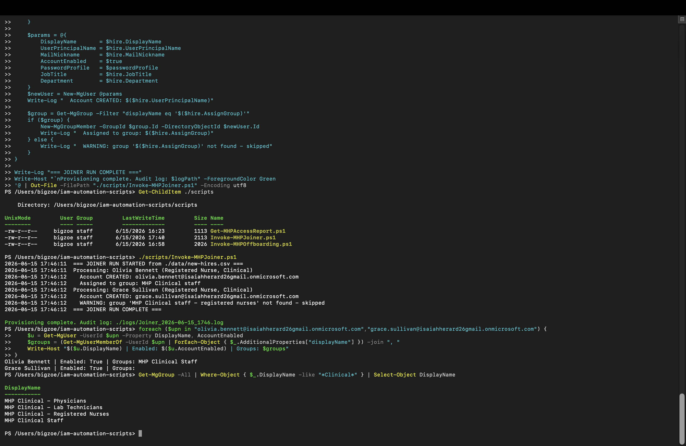
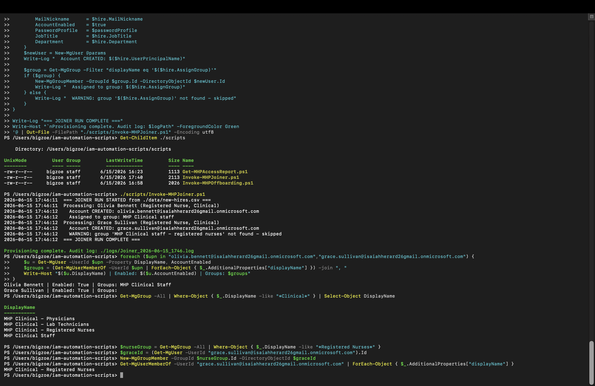

# IAM Automation with PowerShell and Microsoft Graph

Automating the full identity lifecycle (joiner, mover, leaver) and access reporting for **Meridian Health Partners (MHP)**, a simulated ~520-employee regional healthcare network, using the **Microsoft Graph PowerShell SDK** against a live Microsoft Entra ID tenant.

This project is the automation chapter of a hands-on IAM portfolio. Earlier projects executed the user lifecycle, RBAC, PAM/PIM, and SSO **by hand through the Entra portal** to learn the mechanics. This one takes those same operations and turns them into repeatable, parameterized, self-logging scripts, the line between operating a console and engineering a control.

> First time building automation in PowerShell. The README is written to explain not just *what* the scripts do but *why* each command and technique was chosen, so it works as both evidence and a reference.

---

## Why this matters

Clicking through a portal does not scale. The moment a task involves hundreds of users, a quarterly recertification, or a repeatable offboarding runbook, manual work becomes slow, inconsistent, and unauditable. In a regulated healthcare environment, that gap is a direct HIPAA exposure: a terminated employee whose account still works is unauthorized access to protected health information (PHI).

This project closes that gap with three tools:

| Script | Lifecycle stage | What it does |
| --- | --- | --- |
| `Get-MHPAccessReport.ps1` | Review | Exports every user's status, role, and last sign-in to a timestamped CSV for access recertification |
| `Invoke-MHPJoiner.ps1` | Joiner | Provisions new hires from an HR-feed CSV: creates accounts with forced password change and assigns role groups |
| `Invoke-MHPOffboarding.ps1` | Leaver | Deprovisions a departing employee: disables the account, revokes sessions, strips group memberships, all logged |

Every write operation produces a timestamped audit record, so "prove this account was offboarded, and when" is a question answered with a file.

---

## How Microsoft Graph and the PowerShell SDK work

If you are new to this, here is the mental model that makes everything else click.

**Microsoft Graph** is a single REST API that sits in front of all of Entra ID (and most of Microsoft 365). When you click "create user" in the Entra portal, the portal is quietly sending an HTTP request to Graph. There is no separate "portal database", the portal is just a friendly front end for the same API.

**The Microsoft Graph PowerShell SDK** is a set of PowerShell commands (cmdlets) that wrap those same Graph endpoints. So when a script runs `New-MgUser`, it is making the *exact same* underlying call the portal makes. Learning the SDK is therefore learning the real API surface of the platform, not a side tool.

A few patterns that repeat everywhere:

- **Verb-Noun naming, mapped to HTTP.** Cmdlets follow `Verb-MgNoun`. The verb maps to the HTTP method: `Get-` is a GET, `New-` is a POST (create), `Update-` is a PATCH (modify), `Remove-` is a DELETE. Once you know the pattern you can predict cmdlets: `Get-MgUser`, `New-MgUser`, `Update-MgUser`, `Remove-MgGroupMemberByRef`.
- **`-All` handles paging.** Graph returns large result sets in pages of about 100, with a pointer (`@odata.nextLink`) to the next page. Adding `-All` makes the SDK follow those pointers automatically so you get every record. Forgetting it is a classic silent bug, you only get page one and miss users.
- **Scopes are permissions.** You connect with a list of scopes (`User.Read.All`, `Group.ReadWrite.All`, etc.). The token you get back can only do what those scopes allow. This is where least privilege lives.

> Note on versions: the older `AzureAD` and `MSOnline` modules are deprecated. The Graph SDK is the current, supported path, and the correct answer in an interview.

---

## Architecture



---

## Environment and setup

| Component | Detail |
| --- | --- |
| Runtime | PowerShell 7 (PowerShell Core) on macOS, Apple Silicon |
| SDK | `Microsoft.Graph` PowerShell module |
| Directory | Microsoft Entra ID (Entra ID P2) |
| Auth | Delegated, interactive browser sign-in, no stored credentials |

Reproduce the environment in three steps:

```powershell
# 1. Install PowerShell 7 on macOS.
#    The Homebrew CASK is deprecated (fails the macOS Gatekeeper check),
#    so install the community FORMULA instead:
brew install powershell

# 2. Install the Microsoft Graph SDK into your user profile (no sudo needed):
pwsh
Install-Module Microsoft.Graph -Scope CurrentUser

# 3. Connect read-only to start, and verify the session:
Connect-MgGraph -Scopes "User.Read.All","Group.Read.All","AuditLog.Read.All","Directory.Read.All"
Get-MgContext
```

PowerShell Core is cross-platform because Microsoft open-sourced it, and the Graph SDK runs anywhere .NET runs, so identity automation is not tied to a Windows host.

---

## Least-privilege by design

The connection model is the security story of this project. Permissions are requested **just in time** and **only what each task needs**:

- The access report connects **read-only**: `User.Read.All`, `Group.Read.All`, `AuditLog.Read.All`, `Directory.Read.All`.
- The runbooks escalate to **write** only when a write is actually required: `User.ReadWrite.All`, `Group.ReadWrite.All`. Nothing broader (no `Directory.ReadWrite.All`).

Authentication is **delegated** and **interactive** (`AuthType: Delegated`, `TokenCredentialType: InteractiveBrowser`), so MFA is enforceable and no client secret or certificate sits on disk.

The escalation from read to write is deliberate and verified with `Get-MgContext` *before* any write runs, if the scopes were not present, every write would fail with an authorization error.



---

## The scripts

### 1. Access review report, `Get-MHPAccessReport.ps1`

Pulls every user with name, UPN, account status, role, department, and **last sign-in**, and exports a timestamped CSV.

```powershell
./scripts/Get-MHPAccessReport.ps1
# -> ./reports/MHP-Access-Review_<timestamp>.csv
```

How it works, command by command:

- `Get-MgUser -All -Property ...` pulls users. `-Property` is a **server-side `$select`**: instead of returning every attribute on every user, Graph returns only the fields named. Faster, lighter, and the same "ask only for what you need" instinct as least privilege, applied to data.
- `SignInActivity` is a **nested object** (it holds several timestamps), so a **calculated property** flattens just the one we want into a clean column: `@{Name="LastSignIn"; Expression={$_.SignInActivity.LastSignInDateTime}}`. `$_` is the current user in the pipeline; the expression reaches into the nested object.
- A null last sign-in is the finding, not a blank, it flags an account that was provisioned but never used, exactly what an access review escalates.
- `Export-Csv` writes structured objects to a file a reviewer can open and sign off on. The output path carries a timestamp so every run is its own audit artifact and nothing is overwritten.



### 2. Joiner / provisioning, `Invoke-MHPJoiner.ps1`

Reads an HR-feed CSV and provisions each new hire: creates the account with a temporary password that must be changed at first sign-in, then assigns the role group named in the feed.

```powershell
./scripts/Invoke-MHPJoiner.ps1                       # defaults to ./data/new-hires.csv
./scripts/Invoke-MHPJoiner.ps1 -CsvPath ./data/q3-hires.csv
```

How it works:

- `Import-Csv` turns the flat CSV into objects, one per row, where each column header becomes a property (`$hire.DisplayName`, `$hire.AssignGroup`). This is the bridge from an HR file to data the loop can act on.
- `New-MgUser` (a POST to `/users`) creates the account. Entra requires a minimum set of attributes: DisplayName, UPN, MailNickname, AccountEnabled, and a PasswordProfile. The PasswordProfile uses `ForceChangePasswordNextSignIn = $true`, so the user must replace the temporary credential at first login and the admin never knows their permanent password.
- **Splatting** passes the parameters cleanly: build a hashtable `$params = @{...}` and call `New-MgUser @params`. This avoids long lines with backtick continuations and reads better in review.
- `Get-MgGroup -Filter "displayName eq '...'"` is **server-side OData filtering**: Graph returns only the matching group instead of you pulling every group and filtering locally.
- **Defensive group lookup:** if the group is not found, the script logs a warning and moves on instead of crashing. One bad row should not fail the whole batch.



### 3. Leaver / offboarding, `Invoke-MHPOffboarding.ps1`

Deprovisions a departing employee in the correct order: **contain first, clean up second.**

```powershell
./scripts/Invoke-MHPOffboarding.ps1 -UserPrincipalName "james.walker@<tenant>.onmicrosoft.com"
```

1. **Disable** the account (`Update-MgUser -AccountEnabled:$false`, a PATCH). Blocks all new sign-ins. This is the single most important action.
2. **Revoke** active sessions (`Revoke-MgUserSignInSession`, a POST to `/revokeSignInSessions`). Disabling stops *new* sign-ins, but tokens already issued can keep refreshing silently for a while. Revoking invalidates them. Disable plus revoke together is what makes containment immediate; neither alone is enough.
3. **Remove** group memberships. `Get-MgUserMemberOf` returns every kind of object a user belongs to (groups, directory roles, administrative units), so the script filters to `#microsoft.graph.group` before removing, it never accidentally touches a role through the group API.

Every action is written to a timestamped per-user log in `./logs/` via a small `Write-Log` helper built on **`Tee-Object`**, which writes each line to the log file and echoes it to the console at the same time.



---

## Key techniques and concepts (interview-ready)

A consolidated reference for the PowerShell and Graph techniques used here. These are the things to be able to explain out loud.

| Technique | What it is | Why it was used |
| --- | --- | --- |
| **Delegated, interactive auth** | Sign in as a user via browser (`Connect-MgGraph`), no secret on disk | MFA-enforceable, no hardcoded credentials |
| **Just-in-time scopes** | Request read-only first, escalate to write only when needed | Least privilege; smaller blast radius |
| **`-All` paging** | SDK follows `@odata.nextLink` to pull every page | Avoids silently processing only the first ~100 records |
| **`-Property` (`$select`)** | Server-side field selection | Fetch only needed attributes; faster and lighter |
| **Calculated property** | `@{Name=...; Expression={...}}` to flatten nested objects | Turns `SignInActivity.LastSignInDateTime` into a clean column |
| **OData `-Filter`** | Server-side filtering (`displayName eq '...'`) | Returns only matching objects; contrast with client-side `Where-Object` |
| **Splatting** | Pass parameters as a hashtable with `@params` | Clean, readable cmdlet calls with many parameters |
| **`Import-Csv`** | Reads CSV rows into objects | Lets the joiner consume an HR feed as structured data |
| **`Tee-Object` logging** | Write to file and console simultaneously | Self-documenting runbooks with an audit trail |
| **Defensive `if/else`** | Check a lookup succeeded before acting | One bad row does not crash the batch |
| **Idempotent connection guard** | `if (-not (Get-MgContext)) { Connect-MgGraph ... }` | Script is safe to run whether or not you are already connected |
| **Operate on IDs, not names** | Look up an object, then act on its `.Id` | IDs never suffer the casing/spelling/dash drift that display names do |

---

## Troubleshooting and real issues encountered

These were preserved on purpose. Real friction, diagnosed and resolved, is a stronger signal than a frictionless demo.

**1. Homebrew PowerShell cask deprecated.** `brew install --cask powershell` failed with "No Cask with this name exists." The cask was deprecated because it no longer passes the macOS Gatekeeper notarization check. Resolved by installing the community-maintained Homebrew **formula** (`brew install powershell`). The signed `.pkg` from Microsoft's releases page is an equivalent path on May 2026+ builds.

**2. Write scopes not applied until reconnect.** After requesting write scopes, `Get-MgContext` still showed read-only. This caught a real risk: had the runbook attempted a write on that session, every operation would have failed with an authorization error. `Get-MgContext` is the pre-flight check; scopes must be verified before writing.

**3. HR-feed naming drift (en-dash vs hyphen).** The joiner created Grace Sullivan's account but skipped her group: `WARNING: group 'MHP Clinical staff - registered nurses' not found - skipped`. The directory's real group is `MHP Clinical – Registered Nurses`, different wording **and** a different dash (the directory uses an en-dash `–`; the feed used a hyphen `-`). To an exact-match filter these are different strings. This is the canonical HR-feed-to-directory naming-drift problem.

- **The script handled it gracefully** (logged + skipped, did not crash the batch).
- **Diagnosis:** enumerated the real Clinical group names to spot the drift.
- **Remediation:** matched the group on a substring (`-like "*Registered Nurses*"`), then assigned by the group's **ID**, never operate on a display name when an ID is available.
- **Durable fix:** corrected the source feed so the next run is clean, fixing the data, not just the affected record.




---

## HIPAA Security Rule mapping

| Control | Reference | How this project supports it |
| --- | --- | --- |
| Termination procedures | §164.308(a)(3)(ii)(C) | Automated, logged offboarding revokes access immediately and consistently |
| Information access management | §164.308(a)(4) | Provisioning assigns least-privilege role groups based on job function |
| Information system activity review | §164.308(a)(1)(ii)(D) | Access-review report surfaces dormant and over-retained access |
| Unique user identification | §164.312(a)(2)(i) | Each user provisioned with a unique UPN and forced first-login password change |
| Audit controls | §164.312(b) | Every joiner and leaver action is written to a timestamped audit log |

---

## Repository structure

```
iam-automation-scripts/
├── scripts/
│   ├── Get-MHPAccessReport.ps1      # access review export
│   ├── Invoke-MHPJoiner.ps1         # CSV-driven provisioning
│   └── Invoke-MHPOffboarding.ps1    # full deprovisioning runbook
├── data/
│   └── new-hires.csv                # sample HR feed
├── reports/                         # generated access-review CSVs
├── logs/                            # generated audit logs
├── screenshots/                     # evidence (03-24)
└── README.md
```

---

## Production hardening notes

Honest limitations, and how they would be addressed in a real deployment:

- **Temporary password.** The joiner uses a fixed temporary password (forced to change at first sign-in) for lab clarity. In production, generate a unique random password per user and deliver it through a secure channel; never hardcode a credential in a script.
- **Group matching.** Exact-name matching is brittle against feed drift (see troubleshooting). A production pipeline would normalize names or, better, map the feed to group object IDs rather than display names.
- **Joiner idempotency.** Re-running the joiner against an existing user fails on account creation. A production version would check for the user first and update rather than re-create.
- **Delegated auth.** Interactive sign-in is correct for an analyst running these on demand. Scheduled/unattended runs would use a dedicated app registration with certificate auth and tightly scoped application permissions.

---

## Resume bullets earned

- Developed PowerShell automation against the Microsoft Graph API to manage the full identity lifecycle, including CSV-driven user provisioning and complete deprovisioning (account disable, session revocation, and group removal).
- Reduced manual identity management effort by implementing repeatable, self-logging access management processes that produce timestamped audit evidence for HIPAA access recertification.
- Diagnosed and remediated an HR-feed-to-directory naming-drift defect surfaced by defensive automation, applying the fix at the data source to prevent recurrence.

---

## Skills demonstrated

Microsoft Graph PowerShell SDK · Identity lifecycle automation (JML) · User provisioning and deprovisioning · Least-privilege scope design · Delegated authentication · Access recertification · Audit logging · Defensive scripting · OData filtering · HIPAA Security Rule controls
